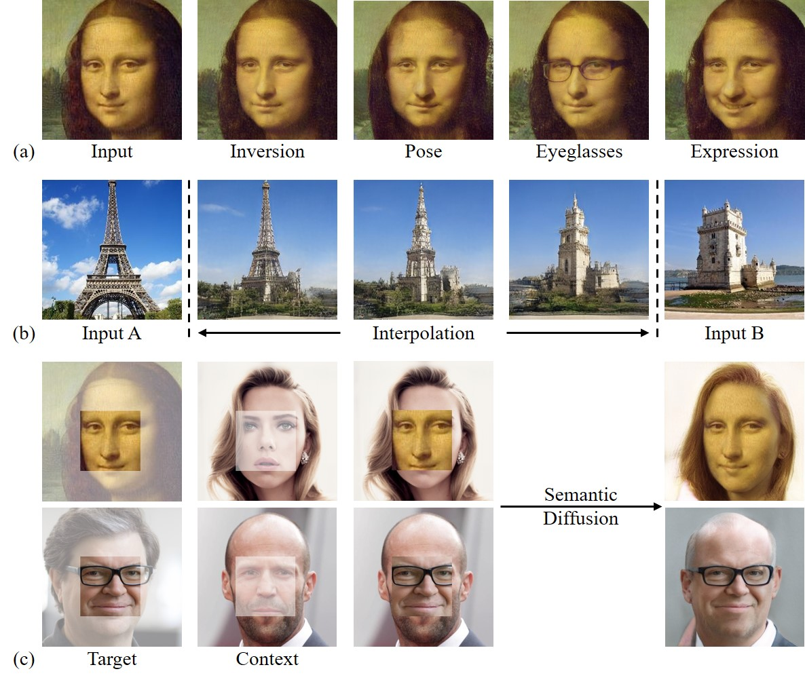

# In-Domain GAN Inversion for Real Image Editing




**Figure:** *Real image editing using the proposed In-Domain GAN inversion with a fixed GAN generator.*

In the repository, we propose an in-domain GAN inversion method, which not only faithfully reconstructs the input image but also ensures the inverted code to be **semantically meaningful** for editing. Basically, the in-domain GAN inversion contains two steps:

1. Training **domain-guided** encoder.
2. Performing **domain-regularized** optimization.

[[Paper](https://arxiv.org/pdf/2004.00049.pdf)]
[[Project Page](https://genforce.github.io/idinvert/)]
[[Demo](https://www.youtube.com/watch?v=3v6NHrhuyFY)]

## Testing

### Pre-trained Models

Please download the pre-trained models from the following links. For each model, it contains the GAN generator and discriminator, as well as the proposed **domain-guided encoder**.

| Path | Description
| :--- | :----------
|[face_256x256](https://drive.google.com/open?id=1MTeDchdtcvTWWQAtYvFHKIJLiuvtq49k)    | In-domain GAN trained with [FFHQ](https://github.com/NVlabs/ffhq-dataset) dataset.
|[tower_256x256](https://drive.google.com/open?id=1breGEmOke7si3RS6BtrrX4NGbCc8Nq-g)   | In-domain GAN trained with [LSUN Tower](https://github.com/fyu/lsun) dataset.
|[bedroom_256x256](https://drive.google.com/open?id=1vvJc6ASbjNdh-VUcpACmSgDMxd6QlQCJ) | In-domain GAN trained with [LSUN Bedroom](https://github.com/fyu/lsun) dataset.

### Inversion

```bash
MODEL_PATH='styleganinv_face_256.pkl'
IMAGE_LIST='examples/test.list'
python invert.py $MODEL_PATH $IMAGE_LIST
```

### Interpolation

```bash
SRC_DIR='results/inversion/test'
DST_DIR='results/inversion/test'
python interpolate.py $MODEL_PATH $SRC_DIR $DST_DIR
```

### Manipulation

```bash
IMAGE_DIR='results/inversion/test'
BOUNDARY='boundaries/expression.npy'
python manipulate.py $MODEL_PATH $IMAGE_DIR $BOUNDARY
```

NOTE: Boundaries are obtained using [InterFaceGAN](https://github.com/genforce/interfacegan).

### Style Mixing

```bash
STYLE_DIR='results/inversion/test'
CONTENT_DIR='results/inversion/test'
python mix_style.py $MODEL_PATH $STYLE_DIR $CONTENT_DIR
```

## Training

The GAN model used in this work is [StyleGAN](https://github.com/NVlabs/stylegan). Beyond the original repository, we make following changes:

- Change repleated $w$ for all layers to different $w$s (Line 428-435 in file `training/networks_stylegan.py`).
- Add the *domain-guided* encoder in file `training/networks_encoder.py`.
- Add losses for training the *domain-guided* encoder in file `training/loss_encoder.py`.
- Add schedule for training the *domain-guided* encoder in file `training/training_loop_encoder.py`.
- Add a perceptual model (VGG16) for computing perceptual loss in file `perceptual_model.py`.
- Add training script for the *domain-guided* encoder in file `train_encoder.py`.

### Step-1: Train your own generator

```bash
python train.py
```

### Step-2: Prepare data for encoder training

Modify `train_encoder.py` as follows:

- Add training and test dataset path to `Data_dir` in `train_encoder.py`.
- Add generator path to `Decoder_pkl` in `train_encoder.py`.

### Step:3 Train your own encoder

```bash
python train_encoder.py
```

## Bibtex

```bibtex
@article{zhu2020indomain,
  title   = {In-domain GAN Inversion for Real Image Editing},
  author  = {Zhu, Jiapeng and Shen, Yujun and Zhao, Deli and Zhou, Bolei},
  journal = {arXiv preprint arXiv:2004.00049},
  year    = {2020}
}
```
